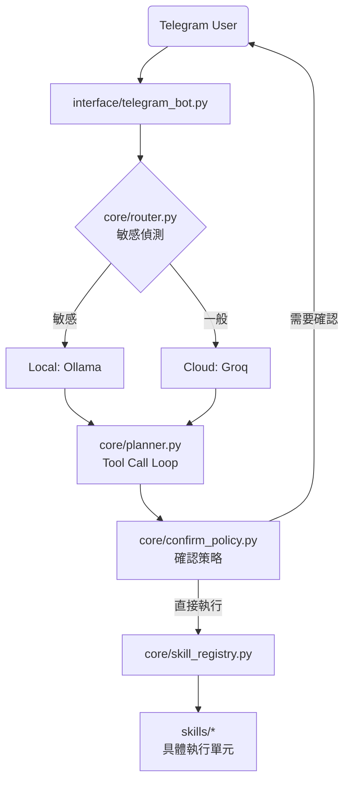

# Claude Agent v2 — 專案開發手冊 (2026-04-30)

> **致 LLM 協作者**：本文件定義了專案架構與開發規範。在開始任務前，請務必先理解「Skill 系統」與「安全原則」，以確保程式碼風格一致且符合非侵入式設計。

---

## 1. 專案核心定位

- **入口**：Telegram Bot（非同步 I/O 驅動）
- **大腦**：LLM Tool Call Loop（取代硬編碼 Intent Mapping）
- **核心架構**：非同步優先、插件化擴展
- **設計哲學**：
- **非侵入式**：嚴禁模擬鍵盤滑鼠，僅透過 API 或 Shell 執行任務
- **隱私優先**：敏感指令自動路由至本地 Ollama 執行
- **確認機制**：破壞性操作需要 /confirm，查詢類直接執行

---

## 2. 技術棧與環境

- **語言**：Python 3.11+（asyncio 驅動）
- **核心庫**：`python-telegram-bot` v21+、`groq`、`httpx`
- **外部整合**：DuckDuckGo（搜尋）、Open-Meteo（天氣）、Playwright（瀏覽器）
- **資料儲存**：SQLite（關聯式）、ChromaDB（向量記憶）
- **設定管理**：`.env` 搭配 `config.py`（Dataclass Singleton）
- **開發環境**：VS Code / Windows 11

---

## 3. 目錄結構

```
.
├── main.py                       # 入口，asyncio.run，支援 --debug / --cli
├── config.py                     # 環境變數載入（.env → dataclass Config 單例）
├── .env                          # API Keys（不 commit）
├── .env.example                  # .env 範本
├── claude.md                     # 本文件
│
├── interface/
│   └── telegram_bot.py           # Telegram Bot（async run），含所有指令 handler
│
├── core/
│   ├── planner.py                # ✅ Tool Call Loop（最多 5 輪），確認機制，對話上下文
│   ├── router.py                 # ✅ 敏感指令路由：偵測關鍵字 → 強制走 Ollama
│   ├── confirm_policy.py         # ✅ 細粒度確認策略（哪些工具需要 /confirm）
│   └── emergency_stop.py         # 緊急停止旗標（threading.Event）
│   └── skill_registry.py         # ✅ Auto-Discovery 插件系統
│
├── services/
│   ├── llm_gateway.py            # ✅ 統一 LLM 呼叫：Groq / Ollama，格式轉換，retry
│   └── task_manager.py           # ✅ asyncio 任務追蹤、緊急停止
│
├── skills/
│   ├── base.py                   # ✅ Skill 抽象基底（requires_confirmation / privacy_level）
│   │
│   ├── info/                     # ✅ Phase 3 完成
│   │   ├── manifest.json
│   │   └── info.py               # 時間、系統資訊、天氣（Open-Meteo）、搜尋（DuckDuckGo）
│   │
│   ├── file/                     # ✅ Phase 3 完成
│   │   ├── manifest.json
│   │   └── file.py               # 讀寫 agent_files/（路徑穿越防護，寫入需確認）
│   │
│   ├── system/                   # ✅ Phase 3 完成
│   │   ├── manifest.json
│   │   └── system.py             # App 控制、音量調整、截圖、Shell Runner（黑名單過濾）
│   │
│   ├── browser/                  # 🔲 待實作（Phase 6）
│   │   └── playwright_ctrl.py
│   │
│   ├── memory/                   # 🔲 待實作（Phase 4）
│   │   ├── short_term.py
│   │   └── long_term.py
│   │
│   ├── gmail/                    # 🔲 待實作（Phase 5）
│   │   └── gmail_skill.py
│   │
│   ├── schedule/                 # 🔲 待實作
│   │   ├── reminder.py
│   │   └── heartbeat.py
│   │
│   └── stream_monitor/           # 🔲 待實作（Phase 6）
│       ├── monitor.py
│       └── webhook_server.py
│
├── storage/
│   ├── db.py                     # 🔲 SQLite（Phase 4）
│   └── vector_store.py           # 🔲 ChromaDB 封裝（Phase 4）
│
├── agent_files/                  # Agent 可讀寫的本地工作區
└── logs/                         # 運行 log（每日輪替，保留 30 天）
```

---

## 4. 系統架構流



---

## 5. 開發規範（Critical）

- **Async-First**：所有 I/O（檔案、網路、LLM）必須使用 `async/await`
- **不模擬鍵盤滑鼠**：系統操作走 subprocess / shell / API，禁用 pyautogui 輸入
- **Tool Call 取代 intent mapping**：技能路由完全由 LLM 決定
- **本地優先敏感資料**：`privacy_level="local_only"` 強制走 Ollama
- **OAuth 授權**：Gmail 等外部服務走 OAuth2，Agent 不直接持有帳密
- **確認機制**：由 `core/confirm_policy.py` 集中管理，不由 skill 類別決定
  - 查詢類（get_weather、read_file、list_files 等）→ 直接執行
  - 寫入/刪除/執行類 → 等 /confirm
- **最大 tool call 輪數（5）**：防止無限迴圈
- **Config 存取**：統一使用 `from config import cfg`
- **路徑管理**：檔案讀寫限制在 `agent_files/`，需通過路徑穿越檢查
- **Shell 黑名單**：`skills/system/system.py` 過濾危險指令

---

## 6. Skill 插件系統規範

Skill 採用**自動探索（Auto-Discovery）**機制，新增功能時在 `skills/` 下建立資料夾：

```
skills/
└── my_skill/
    ├── manifest.json    # 必要：id, tools, privacy_level 等
    └── my_skill.py      # 必要：繼承 Skill，export SKILL_CLASS
```

**`manifest.json` 格式：**
```json
{
  "id": "my_skill",
  "name": "技能名稱",
  "version": "1.0.0",
  "description": "技能描述",
  "requires_confirmation": false,
  "privacy_level": "public",
  "tools": ["tool_a", "tool_b"],
  "enabled": true
}
```

> **注意**：`requires_confirmation` 在 manifest 中只是文件說明用途。
> 實際確認邏輯由 `core/confirm_policy.py` 的 `needs_confirmation()` 控制。

**`privacy_level` 說明：**
| 值 | 說明 |
|---|---|
| `"public"` | 可走雲端 LLM（Groq），不含個資 |
| `"local_only"` | 強制走本地 Ollama，含個資/帳密/信件 |

---

## 7. 已實作工具清單（Phase 3）

### InfoSkill（`skills/info/`）
| 工具 | 說明 | 需確認 |
|---|---|---|
| `get_current_time` | 取得日期時間與星期 | ❌ |
| `get_system_info` | OS / CPU / 記憶體 / 磁碟 | ❌ |
| `get_weather` | Open-Meteo 天氣 + 3 日預報 | ❌ |
| `web_search` | DuckDuckGo 搜尋（Instant Answer + HTML fallback） | ❌ |

### FileSkill（`skills/file/`）
| 工具 | 說明 | 需確認 |
|---|---|---|
| `write_file` | 寫入 agent_files/（含路徑穿越防護） | ✅ |
| `read_file` | 讀取 agent_files/ 內的檔案 | ❌ |
| `list_files` | 列出 agent_files/ 所有檔案 | ❌ |
| `delete_file` | 刪除 agent_files/ 內的檔案 | ✅ |

### SystemSkill（`skills/system/`）
| 工具 | 說明 | 需確認 |
|---|---|---|
| `open_application` | 開啟程式（Start Menu 模糊搜尋）或網址 | ✅ |
| `close_application` | 關閉程式（taskkill） | ✅ |
| `list_running_apps` | 列出執行中應用程式 | ❌ |
| `set_volume` | 音量控制（pycaw / PowerShell / amixer） | ✅ |
| `take_screenshot` | 截圖存到 agent_files/（mss / pyautogui） | ❌ |
| `run_shell` | 執行 shell 指令（黑名單過濾，async subprocess） | ✅ |

---

## 8. 當前進度與任務清單

### ✅ 已完成（Core Framework）
- [x] **LLM Gateway**：Groq / Ollama 雙模切換，JSON Fallback，retry 邏輯
- [x] **Planner**：Tool Call Loop（最多 5 輪），確認機制，對話上下文管理
- [x] **Confirm Policy**：細粒度確認策略，查詢類直接執行，寫入類需 /confirm
- [x] **Skill Registry**：Auto-Discovery，manifest 驗證，工具名稱衝突偵測
- [x] **Telegram Interface**：長訊息切割，async polling，指令 handler
- [x] **Config 系統**：.env 載入，dataclass 單例，路徑自動定位

### ✅ 已完成（Phase 3：系統技能）
- [x] `skills/info`：時間、天氣（Open-Meteo）、搜尋（DuckDuckGo）、系統資訊
- [x] `skills/file`：agent_files/ 讀寫刪除（路徑穿越防護）
- [x] `skills/system`：App 控制（Start Menu 模糊搜尋）、音量調整（pycaw）、截圖（mss）、Shell（async + 黑名單）

### 🔲 待處理任務

#### Phase 4：記憶與 RAG（建議下一步）
- [ ] `skills/memory/short_term.py`：ContextCompressor（token 超限壓縮）
- [ ] `skills/memory/long_term.py`：ChromaDB 向量記憶（從 v1 移植）
- [ ] SQLite 對話持久化（`storage/db.py`）

#### Phase 5：外部整合
- [ ] `skills/gmail/`：Google OAuth2 串接（Gmail 收發信）
- [ ] `skills/schedule/reminder.py`：一次性 + 循環提醒
- [ ] `skills/schedule/heartbeat.py`：早安/晚安定時推播

#### Phase 6：進階能力
- [ ] `skills/browser/`：Playwright 瀏覽器自動化
- [ ] `skills/stream_monitor/`：YouTube WebSub + Twitch EventSub 開播通知

---

## 9. 安裝依賴

```bash
# 核心（必裝）
pip install python-telegram-bot httpx python-dotenv groq

# Phase 3 系統技能（建議安裝）
pip install psutil          # CPU / 記憶體監控
pip install mss             # 截圖（跨平台，推薦）
pip install pycaw comtypes  # 音量控制（Windows 精確版）

# Phase 4（記憶系統）
pip install chromadb

# Phase 5（Gmail）
pip install google-auth google-auth-oauthlib google-api-python-client

# Phase 6（瀏覽器）
pip install playwright
playwright install chromium
```

---

## 10. 啟動指令

```bash
python main.py              # Telegram Bot（預設）
python main.py --debug      # Debug 模式（印出 LLM prompt 與 tool call）
python main.py --cli        # 終端機測試（不需要 Telegram）
```

---

## 11. Telegram 指令

| 指令 | 說明 |
|---|---|
| `/start` | 顯示啟動訊息 |
| `/help` | 顯示可用指令 |
| `/new` | 清除對話記憶 |
| `/stop` | 緊急停止所有任務 |
| `/resume` | 恢復接收訊息 |
| `/status` | 查看目前狀態 |
| `/confirm` | 確認待執行的操作 |
| `/cancel` | 取消待執行的操作 |

---

## 12. 隱私保護對照表

| 指令類型 | 使用模型 |
|---|---|
| 天氣、搜尋、時間、系統資訊 | Groq（雲端） |
| 檔案讀寫、App 控制、Shell | Ollama（本地）|
| Gmail、信件 | Ollama（本地）|
| 記憶、知識庫 | Ollama（本地）|
| 帳密、登入 | Ollama（本地）|

---

## 13. 已知限制與注意事項

- `skills/system/` 的音量控制在 Windows 優先用 pycaw，未安裝時 fallback 到 PowerShell（功能受限）
- `take_screenshot` 優先用 mss，未安裝時嘗試 pyautogui（需要 display）
- Ollama 需要本機先執行 `ollama serve`，gateway 會自動嘗試啟動但可能失敗
- Shell 黑名單覆蓋常見危險指令，但不能保證 100% 安全，建議在沙盒環境使用
- 目前 Skills 資料夾下沒有 `__init__.py`，skill module 以動態 import 方式載入
- Twitch API key 尚未取得，stream_monitor 的 Twitch 功能暫時無法使用